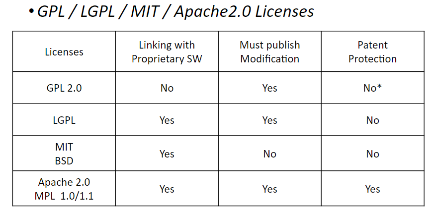

## Week 1-1 강의개요 (강의계획서)

#### _해당 강의 목표_  
>1. oss 개발을 위한 기본 개념과 도구를 익힌다.  
>2. 애자일 기반 소프트웨어 개발 방법을 공부한다.  
>3. 새로운 개발 환경 및 도구를 능동적으로 배운다.
#### [github](https://github.com)  
--> github를 이용한 실습 및 학습 진행 예정
## Week 1-2 오픈소스소프트웨어 개요
#### _오픈소스소프트웨어_     
--> 소프트웨어의 저작권자가 모든사람에게 배포, 사용, 카피, 수정, 배부하는 것에 대한 권리를 준 소스코드
#### _OSS License_  
--> OSS의 그런 권리들을 어디까지 할 수 있는 지를 정해둔 것

**OSS license의 사례**
* GPL : 과 결합하는 모든 소스 코드는 다시 GPL
    - 예시로는 Samba, Linux Kernel 등이 있음
* LGPL : 소스 공개 의무에서 좀 더 완화된 GPL
* MPL : 상용소프트웨어와 결합 허용
    - 저작권 등 표시의 의무가 있음
* BSD : 의무 사항이 거의 없는 라이센스
    - 저작권 표시와 무보증 표시 의무
## Week 2-1 버전 관리 개요
#### 버전 관리 시스템
* **VCS**
    - 작성하고 있는 소스프로그램 파일, 시간이 지남에 따라 변경되기도 하는데, 시간에 지남에 따라서 어떻게 변하고 있는가에 대한 정보를 담고 있음
    - 누가 이 버전 수정을 했는지, 왜 이 수정을 했는지, 이쪽 방향이 아니었는데 등 .. 자유롭게 수정 등등을 담고 있는 소프트웨어다.
* **VCS software**
    - CVS (Concurrent Version System)
    - **SVN (Subversion)**
    - Mercurial
    - Darcs
    - **Git**  
⇒  이런 파일을 저장하는 곳 : Repository, Repo, 저장
#### General Actions in VSC:
- **Checkin**
    - Git의 commit이다. 내가 작업하던 거를 저장소에 집어넣는 것.
    
    - 
    
    - 버전별로 구성이 변화해가고 있음
    - 변화하는 과정에서 r3의 juice가 checkout이 되고, r4에서는 soup이 체크인 됨
- **CheckOut and Editing**
    - 저장소에서 내 로컬 or 드라이브로 가져옴,
    - Git의 fetch이다. (checkout)
    - 편집
- **Diffs**
    - 여러가지 버전 중 차이 점을 제공함
    
    - 
    
- **Branching**
    - 각각의 기능들을 분리하는 것
        
        
        
    - r6 ≠ r7 , 가지치기를 하고 편집 추가 등등을 거치면서 서로 다르게 변화가 생김
- **Merging**
    - 분리되어 있는 기능들을 합치는 것
    - how to combine ? 이 핵심 key
        
    - 
- **Conflicts**
    - merge하는 과정에서 충돌이 발생할 수 있음.
    - 이런 충돌들을 해결하는 과정 .. 은 대개 사람들이 메뉴얼하게 수정함
        
        
        
    - How to resolve ?
        - 이 상황에서는 Sue가 r4 +Hot dog 하기..
        - 또 다른 경우 r4 - cheese , + Hot dog 하기..
- **Tagging**
    - 사용자 관점에 대해서 중요한 곳에 버전과 같은 태그를 붙여서, 패치나 체크아웃 할 때 쉽게 함
- **실제 사례**  
    

각각 서로 다른 분야를 개발하고, 메인 트렁크에 버전을 보낸 후, merge를 진행 및 업데이트 !!
#### Two Main Types of VCS
- **Centralized VCS**
    - 중앙집중형
    - 대표적 예시 : SVN
- **Decentralized (Distributed) VCS**
    - 분산 형태
    - 노트북 로컬에 내가 저장, GitHub에 원격 repository
    - 여러 사람이 협업하게 되면, 원격 저장도 여러개, 로컬도 여러개 ⇒ 이런 식으로 버전 관리를 함
    - 대표적 예시 : GIT
    - pull - 가져오기 push - 보내기
## Week 2-2 Git

- **git add** 를 통해 index로 목록으로 listing 됨
- **git commit**을 통해, index에서 listing된 파일들을 local로 보내서, local에서 버전 관리를 시작함
    - **git commit -a** : 한꺼번에 진행
- **git push**를 통해 local 에서 remote repo로 보냄 ..
- **git fetch**를 통해 remote에서 local로 가져올 수 있음
- **git merge**를 통해 충돌이 나기도 하고, 자동으로 merge 되기도 함. 그렇게 해서 workspace로 가져오게 됨
    - git pull : 한꺼번에 진행하기도 함
- **git diff HEAD** : workspace와 local repo의 비교를 진행
- **git diff** : index와 work 비교를 진행함

### **제일 중요한 것 !!**

>remote repo : 원격 저장소  
>workspace : 실제로 내가 작업하고 있는 곳  
>if i want 버전관리, index 관리 (index = 목록)  
>local repo : commit된 각각의 버전들이 local에 저장되어 있음
## Week 2-3 Github, folk, pull request
### 1. **Fork (포크)**

**포크**는 다른 사람의 GitHub 저장소를 **복사**해서 **자신의 GitHub** 계정에 저장하는 것을 의미합니다.  
이렇게 하면 원본 저장소는 그대로 유지되면서도, 자신만의 복사본을 만들어 수정하거나 추가 작업을 할 수 있음.

**포크의 주요 목적**:
- 원본 저장소에 직접 접근할 권한이 없을 때, 자신의 복사본에서 자유롭게 작업을 진행할 수 있음.
- 오픈 소스 프로젝트에 기여하거나 개인적으로 프로젝트를 수정하고자 할 때 많이 사용됨.

### 2. **Pull Request (풀 리퀘스트)**

**풀 리퀘스트**는 자신이 작업한 내용을 **원본 저장소에 병합해달라고 요청하는 것**입니다.   
보통 포크한 저장소에서 수정 작업을 완료한 후, 그 변경 사항을 원본 저장소에 반영해달라고 요청할 때 사용됩니다.

**풀 리퀘스트의 주요 목적**:
- 포크한 프로젝트에서 수정한 내용을 원본 프로젝트 관리자(저장소 소유자)에게 제출하여 검토 및 병합을 요청함.
- 코드 리뷰, 수정 사항에 대한 논의, 자동 테스트 등을 통해 협업을 촉진하는 도구로 사용됨.

**작업 흐름**:  
1. **Fork**: 원본 프로젝트를 포크하여 자신의 저장소에서 작업합니다.
2. **Branch 생성**: 새로운 기능이나 버그 수정을 위해 별도의 브랜치를 만듭니다.
3. **작업 후 커밋**: 자신의 저장소에서 코드 수정 후 커밋합니다.
4. **Pull Request 생성**: 수정한 내용을 원본 저장소로 보내기 위해 풀 리퀘스트를 제출합니다.
5. **리뷰 및 병합**: 원본 저장소의 관리자가 변경 내용을 검토하고, 문제가 없으면 병합합니다.

> folk와 pull request를 통해 심화 과제를 진행하였으며,  
[해당링크](https://drive.google.com/file/d/1zfWu61frN3ZAjJc0luKZIYbAphJze8it/view)의 52p ~ 부터의 내용이다.

## Week 3 Markdown
1. Italics and Bold
 : 글씨체와 관련한 내용으로 Italics는 글씨체 눕힘, Bold는 글씨체 굵게 기능을 가지고 있다.
2. Headers
헤더는 각 세션의 제목이나 부제를 사용할 때 나타내고 #을 통해 표현한다.
헤더에서도 기울임체, bold를 사용할 수 있다.
3. Links
인라인 링크 : [ ]로 링크할 텍스트를 감싸고, ( )로 링크할 주소를 감싼다.  
인라인 링크에서도 역시 bold를 사용할 수 있으며 헤더에도 링크가 가능하다.  
또한 마크 다운 맨 밑에 [ ]를 이용해 참조 링크를 통해 간단히 링크 연결이 가능하다.
 4. Images
인라인 이미지 링크를 만들려면 느낌표 ( ! )를 입력하고, 대체 텍스트를 대괄호( [ ] )로 묶은 다
음, 링크를 괄호( ( ) )로 묶는다.
참조 이미지의 경우 참조 링크와 동일한 방식으로 적용하여, 간단히 이미지 링크가 가능하다.
5. Blockquotes
인용문에는 > 를 사용하면 되고, 공백이나 줄 바꿈이 있는 문단 전체를 인용문 처리하고 싶으면
모든 문장, 공백 등에 > 를 표시한다. 또한 Italics나 Bold를 포함할 수 있다.
6. Lists
리스트는 *로 표시하는 순서 없는 리스트와 숫자로 표시하는 순서 있는 리스트가 있다.
서브 리스트는 항목을 더 들여쓰기 해서 만들 수 있으며, 리스트 항목 아래에 문단을 추가할 때는 새 줄에 최소 한 칸 이상들여쓰기를 하면 된다.
7. Paragraphs
줄바꿈 없이 문장을 연결하려면 줄 끝에 두 개의 공백 (스페이스 바) 을 넣으면 된다. 이는 문단 연결을 자연스럽게 보이게 만든다.
8. 그 외
더 많은 추가적인 기능이 있으므로, 더 많은 내용을 배우고 싶으면 튜토리얼 내 링크를 참고한다  
##### _해당 링크 모음_ : _[conclusion](https://www.markdowntutorial.com/conclusion/)_
